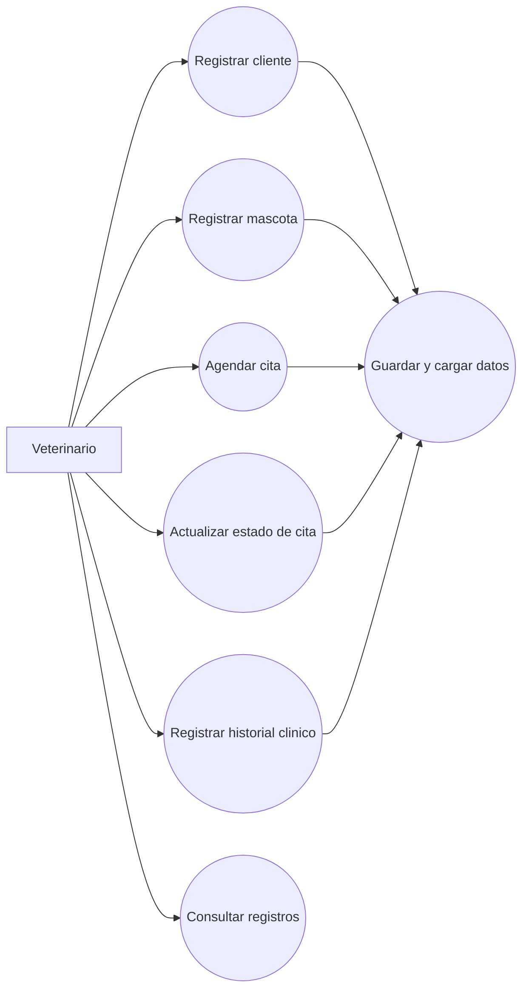
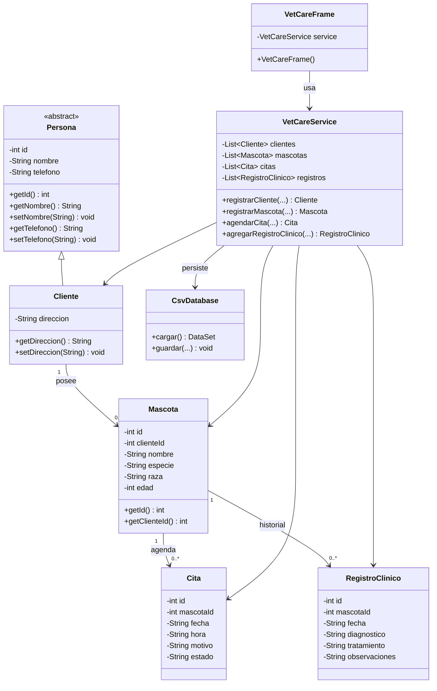

# Portafolio de ingenieria - VetCare

## 1. Levantamiento de requisitos

### Contexto

La Clinica Veterinaria "Huellitas" registra actualmente clientes, mascotas, citas e historiales clinicos en cuadernos de papel. Esto dificulta la consulta rapida, aumenta el riesgo de perdida de informacion y hace lento el seguimiento medico de cada paciente.

### Objetivo general

Construir VetCare, un sistema de escritorio en Java que automatice el registro operativo basico de la clinica y conserve la informacion en archivos CSV.

### Alcance del sistema

VetCare permite:

- Registrar clientes o duenos.
- Registrar mascotas o pacientes asociadas a un cliente.
- Agendar citas medicas por mascota.
- Cambiar el estado de una cita.
- Guardar historial clinico basico por mascota.
- Consultar registros en tablas dentro de la interfaz grafica.
- Guardar y leer datos desde archivos CSV ubicados en `data/`.

Fuera de alcance:

- Facturacion.
- Inventario de medicamentos.
- Autenticacion por roles.
- Conexion a base de datos externa.
- Historia clinica avanzada con examenes adjuntos.

### Historias de usuario

| ID | Historia de usuario | Criterios de aceptacion |
| --- | --- | --- |
| HU-01 | Como veterinario, quiero registrar un cliente para tener los datos del dueno disponibles. | El sistema solicita nombre, telefono y direccion. Si el nombre esta vacio, muestra error. |
| HU-02 | Como veterinario, quiero registrar una mascota asociada a un cliente para controlar sus atenciones. | El sistema exige seleccionar un dueno. La edad debe ser numerica y no negativa. |
| HU-03 | Como veterinario, quiero agendar citas para organizar la atencion diaria. | El sistema exige mascota, fecha en formato `yyyy-MM-dd HH:mm` y motivo. |
| HU-04 | Como veterinario, quiero cambiar el estado de una cita para conocer si fue programada, atendida o cancelada. | El sistema busca la cita por ID y actualiza el estado seleccionado. |
| HU-05 | Como veterinario, quiero guardar un historial clinico por mascota para consultar diagnosticos y tratamientos previos. | El sistema exige mascota, fecha valida y diagnostico. |
| HU-06 | Como usuario de la clinica, quiero que los datos permanezcan al cerrar la aplicacion para no perder informacion. | Al registrar informacion se actualizan los archivos CSV y al iniciar se cargan los datos guardados. |

## 2. Diagramas UML

### Diagrama de casos de uso



### Diagrama de clases



## 3. Plan de pruebas QA

| ID | Caso de prueba | Pasos | Resultado esperado | Prioridad |
| --- | --- | --- | --- | --- |
| QA-01 | Registrar cliente valido | Ingresar nombre, telefono y direccion. Presionar registrar. | Cliente aparece en la tabla y en el selector de duenos. | Alta |
| QA-02 | Registrar cliente sin nombre | Dejar nombre vacio y registrar. | Se muestra mensaje de error y el programa no se cierra. | Alta |
| QA-03 | Registrar mascota valida | Seleccionar dueno, ingresar datos y edad numerica. | Mascota aparece en tabla y selectores de citas/historial. | Alta |
| QA-04 | Edad no numerica | Escribir texto en edad. | Se muestra "La edad debe ser un numero entero". | Alta |
| QA-05 | Edad negativa | Escribir `-1` en edad. | Se muestra error de validacion. | Media |
| QA-06 | Agendar cita valida | Seleccionar mascota, fecha `2026-05-23 09:00` y motivo. | Cita queda en estado PROGRAMADA. | Alta |
| QA-07 | Fecha de cita invalida | Escribir `23/05/2026`. | Se muestra error de formato y el sistema continua abierto. | Alta |
| QA-08 | Actualizar estado de cita | Escribir ID existente y seleccionar ATENDIDA. | La tabla refleja el nuevo estado. | Media |
| QA-09 | Registrar historial valido | Seleccionar mascota, fecha, diagnostico, tratamiento y observaciones. | Registro aparece en la tabla de historial. | Alta |
| QA-10 | Persistencia al reiniciar | Crear datos, cerrar y abrir la app. | Los datos vuelven a cargarse desde CSV. | Alta |

## 4. Manual de usuario

### Inicio

Ejecute la aplicacion con:

```powershell
javac -encoding UTF-8 -d out (Get-ChildItem -Recurse src -Filter *.java).FullName
java -cp out com.huellitas.vetcare.Main
```

### Registrar un cliente

1. Abra la pestana `Clientes`.
2. Digite nombre, telefono y direccion.
3. Presione `Registrar cliente`.
4. Verifique que el cliente aparezca en la tabla.

### Registrar una mascota

1. Abra la pestana `Mascotas`.
2. Seleccione el dueno.
3. Digite nombre, especie, raza y edad.
4. Presione `Registrar mascota`.

### Agendar una cita

1. Abra la pestana `Citas`.
2. Seleccione una mascota.
3. Digite fecha y hora con formato `yyyy-MM-dd HH:mm`.
4. Digite el motivo.
5. Presione `Agendar cita`.

### Actualizar estado de una cita

1. Revise el ID de la cita en la tabla.
2. Escriba el ID en el campo `ID cita`.
3. Seleccione PROGRAMADA, ATENDIDA o CANCELADA.
4. Presione `Actualizar estado`.

### Registrar historial clinico

1. Abra la pestana `Historial clinico`.
2. Seleccione una mascota.
3. Ingrese fecha `yyyy-MM-dd`, diagnostico, tratamiento y observaciones.
4. Presione `Guardar registro`.

## 5. Justificacion de arquitectura

VetCare usa una arquitectura por capas sencilla:

- `model`: contiene las entidades principales del negocio. Se evidencia POO con clases, objetos, encapsulamiento mediante atributos privados y metodos getters/setters, y herencia con `Cliente` extendiendo `Persona`.
- `service`: administra las colecciones en memoria usando `ArrayList`, centraliza validaciones y operaciones del sistema.
- `persistence`: guarda y carga archivos CSV para persistencia basica sin requerir servidores externos.
- `ui`: contiene la interfaz grafica Swing y captura errores con bloques `try/catch` para evitar cierres inesperados.

Esta separacion permite que la interfaz cambie sin modificar directamente las reglas del negocio, y que la persistencia CSV pueda reemplazarse posteriormente por una base de datos si la clinica crece.
